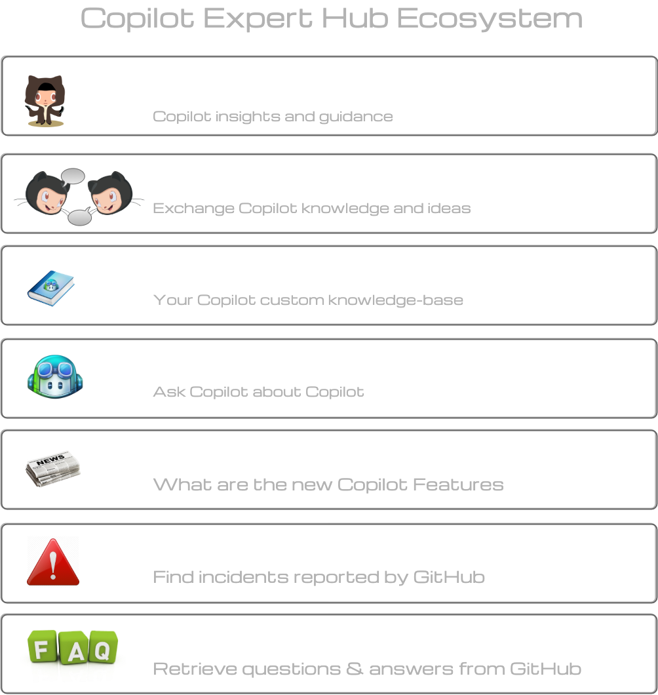

# GitHub Copilot Quickstart

Welcome to the GitHub Copilot Quickstart guide. This guide is designed to help you get started with GitHub Copilot, how to set it up, and take your first steps in using it effectively.

## [Configuring GitHub Copilot in your environment](https://docs.github.com/en/copilot/configuring-github-copilot/configuring-github-copilot-in-your-environment)

### [Visual Studio Code](https://docs.github.com/en/copilot/configuring-github-copilot/configuring-github-copilot-in-your-environment?tool=vscode)

### [Visual Studio](https://docs.github.com/en/copilot/configuring-github-copilot/configuring-github-copilot-in-your-environment?tool=visualstudio)

### [JetBrains IDEs](https://docs.github.com/en/copilot/configuring-github-copilot/configuring-github-copilot-in-your-environment?tool=jetbrains)

### [Vim/Neovim](https://docs.github.com/en/copilot/configuring-github-copilot/configuring-github-copilot-in-your-environment?tool=vimneovim)
